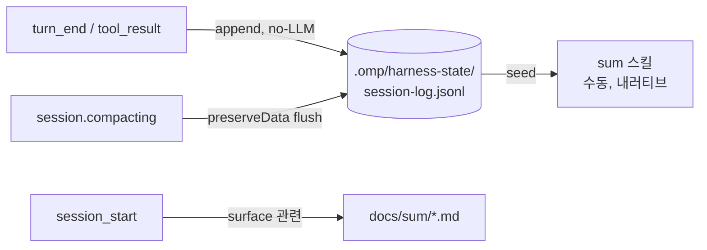

# 하네스 능동적 지식 캡처 — 분석 (living doc)

> **상태**: 진행 중 — 분석 단계, **종합 결정 보류**. 추가 질문(Q2+)을 누적한 뒤 일괄 결정한다.
> **작성**: 2026-06-17
> **동기**: `sum` 스킬의 수동성 한계 → "워크플로우가 결국 *내가 뭔가를 지시해야 함*으로 귀결"되는 문제.
> **선행 분석**: `ecc_harness_analysis.md` §2(L50,52)·§5(step5) · `rules/session_persistence.md` §Decision · `docs/architecture/harness-architecture.md` G7/G8.

---

## 0. 문제 정의 (사용자 원본)

`sum` 스킬(`skill://sum`)의 약점:

1. **명시적 호출 필요** — 사용자가 "sum"이라고 말해야만 동작.
2. **자동 트래킹 안 됨** — `docs/sum/*.md`로 저장은 되지만, 이후 세션에서 자동으로 surface/로드되지 않는 고아 아티팩트.
3. **워크플로우가 수동으로 귀결** — 결국 모든 캡처가 "내가 지시해야 함"에 의존.

**질문**: 이걸 하네스에서 구현해야 하나, 아니면 다른 방식인가?
**범위 주의**: 이 질문은 더 큰 분석(능동적 하네스 자동화 / 수동 지시 의존 축소)의 **첫 조각**이다. Q2+는 아래 §Q2에 누적.

---

## Q1. `sum` 자동화를 하네스에서 할 것인가 (2026-06-17)

### Q1.1 핵심 발견 — 기존 "수동 유지" 결정의 전제가 **사실과 다르다**

`rules/session_persistence.md:25`:

> "Decided 2026-05-27 ... **OMP exposes no such events**, which keeps the decision in force for free."

이 전제는 **현행 OMP에서 거짓**이다. OMP는 세션/턴/압축 라이프사이클 이벤트를 실제로 노출한다 (`omp://extensions.md` "Session lifecycle" + `omp://hooks.md`):

| OMP 이벤트 | 용도 | Claude Code 대응 |
|---|---|---|
| `session.compacting` | `{ preserveData }` 반환 → 압축 시 상태 보존 | **PreCompact (정확히 이 목적)** |
| `session_before_compact` | `{ cancel, compaction }` — 압축 취소/가공 | PreCompact |
| `session_compact` | 압축 완료 후 | — |
| `session_shutdown` | 세션 종료 | Stop(유사) |
| `turn_end` / `agent_end` | 턴/에이전트 종료 | Stop(턴) |

→ **결론 변화**: "기술적으로 훅이 없어서 불가능"은 더 이상 차단 사유가 아니다. 이제 판단 기준은 *실현가능성*이 아니라 **가치 대비 노이즈**뿐이다. (이 전제가 틀렸으니 `session_persistence.md` §Decision과 `harness-architecture.md` G7/G8은 어차피 수정 대상.)

### Q1.2 사용자가 한 덩어리로 묶은 니즈는 사실 3개다

| 니즈 | 산출물 성격 | 현재 상태 | 올바른 위치 |
|---|---|---|---|
| **A. 영속 사실** (결정·함정·워크플로우) | 프로젝트 범위, 교차 세션, 모델 추출·redact | ✅ **이미 자동** — auto-memory가 세션 히스토리 추출 → `memory_summary.md`를 세션 시작 시 주입 | 이미 해결. **새로 만들 것 없음** |
| **B. 세션 재개용 breadcrumb** (변경 파일·테스트 PASS/FAIL·커밋·AC 토글) | 단일 세션, 저비용, LLM 불필요 | ⚠️ **부분 자동** — `.omp/harness-state/`에 `read-log.txt`·`backpressure-status`·`test-history.json` 이미 append 중 | **하네스** (기존 트래커 확장) |
| **C. 재현 가능한 트러블슈팅 내러티브** (diff 포함 런북) | 단일 스레드, 인간 판단 필요 | ❌ 수동 (`sum`) | **수동 유지** — 단, *이유가 바뀐다* (Q1.4) |

**핵심 통찰 2가지**:
- **A는 이미 돌고 있다.** auto-memory(`omp://memory.md`; `memory.backend: local`)가 활성 상태이고 이 세션에도 `<memories>`가 주입됨. 사용자 불만의 상당 부분("자동 트래킹")이 이미 해소돼 있으나 인지되지 않았을 뿐. **단, auto-memory ≠ sum 대체** — auto-memory는 *세션 히스토리*를 읽지 `docs/sum/*.md`를 읽지 않으며, 산출물은 사실/결정 중심(`MEMORY.md`)이지 diff 런북이 아니다. 둘은 **상호보완**.
- **`docs/sum/` 고아 문제는 진짜 갭.** auto-memory가 sum md를 안 읽으므로, 사람이 다시 열지 않는 한 묻힌다.

### Q1.3 왜 스킬이 아니라 하네스인가

- **스킬은 본질적으로 수동 호출** → 사용자의 핵심 불만("내가 지시해야 함")을 그대로 재생산. 자동 캡처를 스킬로 푸는 건 모순.
- **하네스는 이미 이벤트 + `.omp/harness-state/` + append-log 패턴을 소유.** breadcrumb은 신규 게이트 1개 수준의 증분(기존 `backpressure-tracker`가 `test-history.json`에 append하는 패턴 그대로).
- **auto-memory는 사실 축을 이미 자동 처리** → 재구축 금지.

### Q1.4 C(내러티브)는 왜 여전히 수동인가 — *이유가 바뀐다*

- 폐기되는 이유: ~~"OMP에 이벤트가 없어서"~~ (거짓).
- **새 이유(타당)**: 좋은 런북은 *"이 작업 스레드가 끝났고 + 보존할 가치가 있다"*는 인간 판단이 필요한데, **어떤 이벤트도 그 의미를 인코딩하지 못한다**:
  - `session_shutdown` = 프로세스 종료(작업 중 Ctrl-C 포함) ≠ 작업 완료.
  - `turn_end` = 매 턴 ≠ 작업 완료.
  - → 이 위에서 LLM 자동 요약을 돌리면 **미완 스레드의 저품질 요약을 끝없이 양산**.
- 따라서 풀 내러티브는 수동 유지. 단 **자동 breadcrumb이 씨앗을 대주면** sum 호출 비용이 급감.

### Q1.5 권장 설계 (잠정)



- **`turn_end`/`tool_result` → breadcrumb append** (LLM 없음): 변경 파일, 테스트 PASS/FAIL, 커밋 해시, AC 토글. 기존 `test-history.json` 패턴 확장.
- **`session.compacting` → flush/preserve** (진짜 PreCompact 용도, `preserveData` 반환).
- **`session_start` → 관련 `docs/sum/` 표면화** (고아 md 해소). 현재는 `harness-version-check`만 하지만 `session_persistence.md:38`이 이미 "surface relevant prior context" 의도.
- **`sum`은 수동 유지 + breadcrumb을 seed로 읽음**.
- **`session_shutdown`에서 LLM 요약 금지** (프로세스 종료 시점, 비동기 LLM 신뢰 불가 — flush 정도만).

### Q1.6 영향받는 문서 (진행 시 동기 수정 대상)

- `rules/session_persistence.md` §Decision (L23–32) — 전제 "no such events" 정정 + 결정 재서술.
- `docs/architecture/harness-architecture.md` G7/G8 (L285–294) — "의도적 미채택" 근거 정정.
- `claudedocs/ecc_harness_analysis.md` L50·L52·L94 — PreCompact/instinct 항목 cross-ref 갱신.
- (`AGENTS.md` Harness Enforcement 표 — breadcrumb 게이트 신설 시 행 추가.)

### Q1.7 미결 사항 (Q1 내부)

- [ ] 구현 범위 — 옵션 4종 (아래).
- [ ] 트리거 선택 — `turn_end` vs `tool_result` vs `session.compacting` 조합.
- [ ] breadcrumb 저장 위치/포맷 — `.omp/harness-state/session-log.jsonl`? `docs/sum/.breadcrumbs/`?
- [ ] `docs/sum/` ↔ auto-memory 연계 — auto-memory가 sum md도 읽게 할지, 별도 surface만 할지.

**구현 범위 옵션 (보류 중)**:
1. **(권장)** breadcrumb 게이트(`turn_end`/`tool_result`, no-LLM) + `session_start` docs/sum 표면화 + sum이 seed 소비. 최대 ROI.
2. **(최소)** 신규 자동화 없이 auto-memory 활용 확인·문서화 + `session_start` 고아 md 표면화만.
3. **(풀)** 1 + `session.compacting` sum 초안 자동 생성(수동 승인). 자동화 강하나 노이즈 위험.
4. **(보류)** 결정/설계만, 구현 후순위.

---

## Q2. 자율 finding→issue→fix→PR→교차검증→HITL 루프 (2026-06-17)

### Q2.0 비전 (사용자 원본)
- 현재 문서화·참고는 `sum`(=`docs/sum/` md) 기반.
- 과거 "GitHub 이슈 생성으로 전환" 시도 기억 → **이 레포엔 흔적 없음**(session_search 0건, repo grep은 `compr`의 `pr_create`뿐, `.github/` 부재). 타 프로젝트/미커밋/구상 단계로 추정.
- 목표 루프: **발견사항 → 자동 이슈 생성 → 수정 → PR 생성 → (PR 시) Codex 포함 교차검증 → 판단 필요 지점이면 자동 정지 + 이슈로 질문 게시 + 사용자 응답 대기 → 사용자 반응(이슈 댓글 등)을 최우선**.

### Q2.1 핵심 판단 — 두 축을 분리하라 (실행 ≠ 저작·배포)
사용자 핵심 질문("왜 하네스에서?")은 *런타임*이 아니라 **저작·배포·버전관리** 축을 물은 것. 두 축을 분리하면 모순이 사라진다:
- **실행(런타임) 축**: 이 루프는 **세션 내 하네스 게이트가 아니다**. 교차 세션·이벤트 구동·재개형 → 런타임은 각 프로젝트의 **GitHub Actions/웹훅**. (하네스 게이트 context/acceptance/backpressure/review는 각 headless 호출 *안에서* 가드레일로 계속 작동.) 본질은 "autopilot을 GitHub 이벤트에 배선 + 이슈 HITL".
- **저작·배포 축**: **여기서(템플릿 레포) 만드는 게 정확히 맞다.** 이 레포가 `harness-sync.sh`("remote wins")로 모든 프로젝트에 강제 동기화되는 **표준 템플릿**이고 `harness/*` 태그로 버전관리됨 → "여기서 만들고 고정 → 모든 작업이 상속"은 **이미 작동하는 메커니즘**. 상세 = §Q2.9.

### Q2.2 가장 어려운 부분 — 인간 게이트의 상태성 (the crux)
- "정지하고 사용자 응답을 시간/일 단위 대기"는 프로세스 블로킹 불가 → 루프는 **stateless-resumable** 필수.
- 상태 저장소 = **GitHub 자체**(이슈/PR + 라벨 + 댓글) = 버스+상태머신. ± OMP 세션 resume(SDK `SessionManager.open/continueRecent`, `omp://session-operations...`).
- HITL 패턴: 결정점 도달 → 구조화 질문을 이슈/댓글로 게시 + `needs-decision` 라벨 → **세션 종료**. 재개 = 다음 이벤트(라벨된 댓글/이슈 수정). 에이전트는 `issue://`(SQLite 캐시) 댓글 read → **최우선** 취급(CLAUDE.md "user instruction > memory"와 정합).

### Q2.3 오케스트레이션 substrate — 4 옵션
- **A. GitHub Actions 네이티브** (events: `issues`/`pull_request`/`issue_comment`) → self-hosted runner에서 OMP headless(SDK/print) 호출. GitHub=bus+state, 재개 자연스러움. 단 CI 신설 + runner 인증(gh·Codex 키). 이 레포 `.github/` 부재 = 그린필드.
- **B. 로컬 데몬** 폴링 → OMP 세션 구동. 완전 제어이나 bespoke 장기 프로세스 = ecc2 "Rust 컨트롤플레인"으로, 레포가 **명시적으로 오버엔지니어링이라 기각**한 패턴(`ecc_harness_analysis.md` §4 L75). **비권장**.
- **C. 단일 세션 인-세션** (`gh` + `job`/`irc` + 댓글 폴링). 프로토타입 최단이나 취약: 세션 점유·장시간 대기·크래시 내구성 0.
- **D. 하이브리드 (권장 시작점)**: 수동 킥오프(네가 finding 지목 or 이슈 라벨) → 에이전트가 autopilot→`pr_create`→Codex 리뷰를 한 세션에 수행 → 유일한 async 게이트는 "질문을 이슈에 게시 후 종료; 준비되면 네가 재호출". 최소 인프라·기존 자산 재사용. 검증되면 A 승급.

### Q2.4 구성요소별 위치 (재사용 vs 신규)
| 단계 | 메커니즘 | 상태 |
|---|---|---|
| finding→issue | `gh issue create`(bash) + 얇은 스킬 | ⚠️ **신규(소)** — OMP `github` 툴엔 `issue_create` 없음(`pr_create`만) |
| issue→fix→PR | OMC `autopilot`/`ralph` + 하네스 게이트 + `github.pr_create` | ✅ **이미 있음** |
| PR→교차검증 | `codex` 컴패니언 `review`/`adversarial-review` · `ccg` · `reviewer`/`adversary` 에이전트 · (선택)CI `github.run_watch` | ✅ **이미 있음** |
| 결정게이트→이슈→대기 | `needs-decision` 라벨 컨벤션 + 구조화 질문 게시 + 종료/재개 | ⚠️ **신규(핵심·최난)** |
| 사용자응답 우선 | `issue://` 댓글 read → 최우선 | 규칙 존재, 배선 신규 |
| 재개 | SDK `SessionManager.open/continueRecent` or fresh+컨텍스트 reload | substrate 존재 |

### Q2.5 위험·열린 결정
- **결정점 탐지 캘리브레이션 = 진짜 난제**(plumbing 아님). 과(過)정지=짜증, 과소정지=잘못된 자율 머지. → **머지 절대 자동 금지, 교차검증 advisory, 머지는 인간 승인**.
- **노이즈/중복**: finding→issue 폭주(Q1 다대다 우려 재현). dedup/throttle/라벨 필요.
- **인프라·보안**: self-hosted runner(로컬 gh·Codex 인증 재사용) vs GitHub-hosted(시크릿·Codex 키 반입) — 비용·보안 트레이드오프.
- **Codex in CI**: 컴패니언은 현재 로컬 플러그인(`CLAUDE_PLUGIN_ROOT`). CI 이식 = Codex CLI+인증 필요 or self-hosted runner 재사용.
- **루프 안전**: 폭주 방지(반복 한도), 파괴 작업 가드(`destructive-guard`는 advisory).

### Q2.6 Q1과의 수렴 (중요)
- Q1 불만 "md 자동 트래킹 안 됨"을 Q2가 **직접 해소**: 재개/발견 아티팩트를 `docs/sum/` md 대신 **GitHub 이슈**로 만들면 GitHub이 곧 트래킹 시스템(라벨·검색·상태·알림).
- 즉 Q1의 breadcrumb은 Q2 루프의 **finding 소스**가 될 수 있고, "어디 저장하나(docs/sum vs 이슈)"는 두 질문 공통 결정. → **Q1 §B/docs/sum 연계 결정은 Q2 substrate 선택과 묶어야 함**.

### Q2.7 권장 단계화 (잠정)
1. (지금) 비전·결정 문서화 — this.
2. (1차 PoC) 옵션 D 최소 루프: `gh issue create` 스킬 + autopilot 연계 + `pr_create` + Codex 리뷰 1패스 + `needs-decision` 라벨 컨벤션. 단일 세션·수동 재호출.
3. (검증 후) 옵션 A 승급: `.github/workflows/` + self-hosted runner + `issue_comment` 트리거로 재개 자동화.
4. (선택) finding 자동 탐지(리뷰/린트 발견 → 이슈) 연결.

### Q2.8 미결 사항 (Q2 내부)
- [ ] substrate 선택 + D→A 승급 시점.
- [ ] 결정점 탐지 방식(에이전트 자가판단 vs 게이트 신호 vs 규칙).
- [ ] finding 소스 — 수동 지목 vs 자동(breadcrumb/리뷰/린트).
- [ ] 재개 아티팩트 — `docs/sum` md vs GitHub 이슈(Q1 수렴).
- [ ] runner — self-hosted vs GitHub-hosted, Codex CI 이식 여부.
- [ ] 적용 레포 — 이 하네스 레포 vs 실제 작업 레포(타 프로젝트).
- [ ] 신규 스킬 전파 = `harness-sync.sh` PATHS allowlist 추가 필요 / CI는 `templates/` 인스턴스화-once (§Q2.9).

### Q2.9 배포 메커니즘 분석 — 자산별 전파 경로 (사용자 질문 직답)
`harness-sync.sh` 화이트리스트(PATHS, L91–119)가 "무엇이 모든 프로젝트로 전파되는가"를 가른다. 정책 = **remote wins 무조건 덮어쓰기**(소비 경로 `migrate`/`init`/`harness-check`).

| 자산 | 지금 전파? | 경로 / 필요한 일 |
|---|---|---|
| 규칙·컨벤션 (`needs-decision` 프로토콜, merge-never-auto) | ✅ 자동 | `rules/` 통째 sync |
| 신규 에이전트 (예: Codex-리뷰 에이전트) | ✅ 자동 | `.omp/agents` 통째 sync |
| 신규 스킬 (issue→fix→PR→review 흐름) | ⚠️ 조건부 | `.omp/skills/`는 통째가 아니라 **개별 allowlist** — PATHS에 그 스킬을 **추가해야** 전파(현재 13개만) |
| CI 워크플로우 (`.github/workflows/*.yml`) | ❌ 안 됨 | 화이트리스트에 `.github/` 없음 → **`templates/` 아래 템플릿으로 싣고 `init`/`migrate`가 1회 인스턴스화**(force-sync 금지) |

**핵심 결론**: "여기서 만들고 고정 → 모든 작업 상속 + 버전관리"는 **옳고 이미 작동**(엔진=`harness-sync.sh`, 버전=`harness/*` 태그, provenance=`harness-meta.json`). 단 자산 클래스별 배선이 다름:
- 규칙/에이전트 = **오늘 그냥 됨**. 재사용 가치의 대부분(컨벤션·리뷰 에이전트)이 여기 속함 = boring·safe.
- 스킬 = PATHS 한 줄 추가.
- **CI는 force-sync 금지**: (a) `.github/` 미화이트리스트, (b) "remote wins"라 force-sync 시 **각 프로젝트 고유 CI를 매 sync마다 클로버**(migrate가 rules/AGENTS.md에 경고한 동일 위험), (c) CI는 파일 복사로 turnkey 불가(프로젝트별 runner+시크릿 필요) → **인스턴스화-once 템플릿**(`templates/.github/…` → `init`/`migrate` 1회 복사, 이후 미동기화).

→ 모순 해소: **레포 = 저작·버전·배포 SoT / GitHub Actions = 실행**. 같은 시스템의 두 층.

### Q2.10 CI 배포 입도 — "정책문서만 만드는가?"에 대한 답 (2026-06-17)
**doc-only은 과소.** 순수 문서만 두면 프로젝트마다 워크플로우를 손으로 재작성 → 벗어나려던 "매번 설정"을 CI층에서 재생산. 단 force-sync도 금지(클로버). 핵심 구분: **"템플릿 워크플로우" ≠ "force-sync 워크플로우"** — 로직은 재사용 자산이라 중앙 버전관리 가능.

불변(중앙 1곳) vs 프로젝트별(파라미터) 분리:
- **불변 (~90%)**: 트리거(issue labeled/PR opened/comment), 스텝(checkout→OMP headless 실행→이슈/댓글 게시→HITL 게이트→Codex 리뷰), `needs-decision` 의미, 머지-자동금지.
- **프로젝트별**: owner/리모트, runner 라벨(self-hosted vs hosted), 시크릿 이름/유무(Codex·gh), 기본 브랜치, path 필터, Codex 컴패니언 설치 여부.

GitHub Actions 1급 메커니즘 = **reusable workflow(`workflow_call`) + composite action**: 불변 로직을 **템플릿 레포의 `.github/workflows/loop.yml`** 한 곳에 두고 `uses: rae-hugo-kim/omp/.github/workflows/loop.yml@harness/<tag>`로 **태그-고정 참조** → 각 프로젝트는 입력만 넘기는 얇은 caller 워크플로우만 둠. = "한 번 만들어/상속/버전고정"의 CI판 정답. (이 경우 템플릿 레포는 `.github/`를 가지되 **sync 복사가 아니라 by-tag 참조**라 화이트리스트와 무관. 접근성 주의: caller 레포가 템플릿 레포 읽기 가능해야 — 동일 owner/공개면 OK.)

**템플릿이 싣는 3층**:
1. **정책·계약 문서**(`rules/`, 오늘 자동 전파): `needs-decision` 프로토콜·머지금지·결정점 기준·라벨 택소노미.
2. **로직**: reusable workflow(중앙, 태그 고정) — 최소안은 `templates/` 인스턴스화-once 스켈레톤.
3. **셋업 스킬**: 대상 프로젝트 1회 실행 → 리모트/구조/시크릿 점검 후 caller 생성·배선("리포 구조 따라 설정"을 수동→스킬 자동화).

→ 정정: 사용자 표현 "정책문서만"이 아니라 **"정책문서 + 중앙 로직(reusable workflow) + 1회 인스턴스화 스킬"**. 프로젝트별 잔여 = 파라미터뿐(스킬이 채움).

---

## Q3. 멀티-세션 오케스트레이션 — 메인=핸들러, 워커 세션=리뷰/코드생성, 동적 스케일 (2026-06-17)

### Q3.0 질문
"omp 전제. 메인은 핸들링만, **멀티 세션**(이 세션 내 멀티 에이전트가 아니라 별도 세션들)이 리뷰·코드생성. PR/이슈 내용에 따라 코드생성/리뷰 세션을 **동적 증감**. 이런 오케스트레이션 툴이 있나? 없으면 만들 수 있나? (paseo는 Mac 전용)"

### Q3.1 개념 구분 (핵심)
- **in-session 멀티 에이전트**: 한 프로세스/컨텍스트 안 서브에이전트. = OMP `task`(≤32 동시), `eval`의 `parallel()`/`agent()`/`pipeline()`. 컨텍스트·실패 공유.
- **멀티-세션 오케스트레이션(사용자가 원하는 것)**: 별도 프로세스·컨텍스트·세션파일 워커를 **얇은 리드**가 spawn/모니터/수집/증감. 격리·내구·독립.
- → 사용자가 정확히 짚음: N개가 한 컨텍스트 공유(`task`)가 아니라, 각자 깨끗한 컨텍스트의 N세션을 리드가 조율.

### Q3.2 OMP 네이티브 현황 — turnkey **없음**, 기반만
- **in-process**: `task`(서브에이전트, 별도 세션 아님), `eval parallel/agent`. → 원하는 "멀티 세션"이 **아님**.
- **멀티-세션 기반(직접 구축용)**: `omp --mode rpc`(별도 프로세스, JSONL-over-stdio, `new_session`/이벤트 스트림/host-tool) · SDK `createAgentSession`×N · headless `omp -p`×N.
- 결론: "리드가 N개 OMP 세션 구동 + 동적 스케일"하는 **기성 스킬은 OMP에 없다.** 기반(RPC/SDK)은 충분.

### Q3.3 인접 도구 (재사용/참고)
| 도구 | 멀티 세션? | Linux? | 동적 스케일 | omp 워커? | 한계 |
|---|---|---|---|---|---|
| OMC `team` | ✅ 워커=별도 Claude Code 세션, 리드 조율, 스테이지 파이프라인 | ✅ tmux/psmux | ✅ `OMC_TEAM_SCALING_ENABLED` scale_up/down | ❌ **Claude Code 런타임** | "omp 전제"와 어긋남 |
| OMC `omc-teams` | ✅ tmux 패널 CLI 워커(claude/codex/gemini) | ✅ tmux | ❌ 고정 N(1–10), one-shot | ❌ CLI(omp 아님) | 정적·팀통신 없음 |
| 외부 Paseo | ✅ | ❌ **Mac 전용** | — | ❌ | 제외(환경) |
| 외부 Maestro/LINCE/hive | ✅ | 대체로 ✅ | 일부 | ❌ 범용 CLI | 하네스/GitHub 루프와 통합 안 됨 |

→ **개념적 최근접 = OMC `team`**(멀티 세션 + 동적 스케일 + per-role 라우팅 이미 구현) — 단 Claude Code 기반. OMP판 = 이 패턴을 RPC 위에 재현.

### Q3.4 만들 수 있나 — 그렇다 (RPC/SDK 컨트롤러)
얇은 컨트롤러 프로세스가:
1. 이슈/PR read(`gh`/`issue://`/`pr://`) → 작업 분류.
2. 워커 풀 shape 결정(동적 할당, §Q3.5).
3. 워커 세션 spawn — `omp --mode rpc` 자식 N개(권장: 프로세스 격리) 또는 SDK `createAgentSession`×N.
4. 모니터 — RPC 이벤트 스트림(`agent_end`/`tool_execution_*`)·세션 아티팩트 수집.
5. 증감·집계 → GitHub 루프(Q2)로 피드백.

### Q3.5 동적 자원 할당 — 가능 + 선례
- **선례**: `team`의 `scale_up`/`scale_down`(드레인)·per-role provider 라우팅이 패턴 입증.
- **신호 소스(이미 존재)**: `pr://<N>/diff` 파일수·LOC·언어 / 하네스 `risk-assess.mjs` 위험 분류 / 이슈 task-list 길이 / 라벨.
- **정책 예**: 리뷰어 = ceil(changed_files / K) cap M; 코드생성 = 독립 서브태스크 수; risk=high → 리뷰어 +Codex. 컨트롤러가 풀 spawn/retire.

### Q3.6 난제·caveat
- **교차 프로세스 조정**: OMP `irc`는 *이 프로세스* 한정 → 별도 세션 간 조정 불가. 허브 = 컨트롤러(RPC host-tool/이벤트) 또는 공유 FS(`shared_memory` MCP·`local://`) 또는 GitHub. 워커끼리 직접 대화 X.
- **비용·인증**: 세션마다 모델콜·API키·토큰예산 → N배. 동시성·예산 상한 필수.
- **경계 주의**: 이건 Q2.3의 **B(로컬 데몬/컨트롤플레인)** 패턴 — 레포가 경계한 ecc2 류. → **얇은 RPC 오케스트레이터**로 한정, 대시보드/데몬 제품화 금지.

### Q3.7 Q2와의 관계
Q3 = **Q2 루프의 실행 엔진**. Q2 "issue→fix→PR→review"의 *fix*·*review* 단계가 Q3 동적 워커 풀로 fan-out. 저작·배포는 Q2.9/Q2.10대로(템플릿 저작 + 프로젝트별 실행). 즉 Q3는 Q2 하위 실행층, 독립 기능 아님.

### Q3.8 미결
- [ ] 워커 런타임 — `omp --mode rpc`(격리) vs SDK in-proc(경량) vs `omp -p` 서브프로세스.
- [ ] 컨트롤러 위치 — Q2 CI runner 내부 vs 로컬 컨트롤러.
- [ ] 조정 버스 — RPC 중계 vs `shared_memory` vs GitHub.
- [ ] 스케일 정책 파라미터(K/M/risk 가중) + 동시성·비용 상한.
- [ ] `team` 패턴 차용 범위(RPC 포팅 vs 신규).

### Q3.9 실행 기질·영속성 축 — tmux 쓰냐? / WSL 충분? (2026-06-17, 실측 반영)
**별개의 직교 축 맞다.**
- **축A (Q3)**: 워커 spawn/격리 — in-process vs 별도 프로세스(RPC/SDK) vs tmux 패널.
- **축B (이 질문)**: 프로세스 영속성 — 무언가 시간/접속해제를 넘어 **살아있어야 하나?**
- **핵심: 영속성 필요 여부는 Q3가 아니라 Q2 substrate가 결정.**
  - 이벤트구동(Q2-A): stateless, 아무것도 안 살아있음, 상태는 GitHub, 이벤트마다 fresh spawn→exit → **tmux/영속성 무관.**
  - 장기 컨트롤러/세션(Q2-C/D): 무언가 살아있어야 → 영속성 메커니즘 필요.
- tmux는 2가지를 묶음: (1) 터미널 멀티플렉싱(시각 패널 — headless엔 불필요), (2) detach/reattach 영속성(인터랙티브). **무인 자동화의 올바른 영속 기질은 tmux가 아니라 `systemd`**(사람이 눈으로 reattach하는 게 아니므로). `team`/`omc-teams`가 tmux를 쓰는 건 구현 선택일 뿐 — OMP RPC 오케스트레이터는 자식 프로세스를 직접 띄워 **tmux 불요**.

**WSL(Ubuntu)/WT 충분한가 — 자율도별** (실측 이 박스: `systemd=true`·pid1=systemd(running)·`/usr/bin/tmux`·gh 인증 rae-hugo-kim/repo scope·self-hosted runner 미설치):

| 단계 | 충분? | 비고 |
|---|---|---|
| 인터랙티브/로컬 PoC (Q2-D, 네가 킥오프·현장) | ✅ 충분 | 지금 그대로. RPC 멀티세션 = 자식 프로세스일 뿐 |
| 로컬 멀티세션 오케스트레이션(온디맨드) | ✅ 충분 | self-hosted runner를 **systemd 유닛**으로도 가능(systemd 이미 켜짐) |
| 완전 자율·상시 응답 (Q2-A, 새벽 이슈 댓글에도 반응) | ⚠️ **부족** | WSL2 데스크톱은 24/7 서버 아님(닫으면 suspend·재부팅 시 종료) → (a) GitHub-hosted runner(클라우드; 키=secret, Codex 컴패니언 부재 가능, 분당 과금) 또는 (b) 상시 호스트(VPS/서버, 또는 데스크톱 상시가동+WSL idle종료 비활성+runner systemd) |

→ **"tmux/영속성"과 "WSL 충분?"은 같은 질문 — "루프가 상시-가동 호스트를 요구하나?" — 답은 자율도(=Q2 substrate)가 결정.** 수동/PoC = 상시호스트 불요 → WSL 충분(tmux도 불요, systemd는 보너스). 완전자율 = 상시호스트 필요 → WSL-데스크톱 부족 → 클라우드 runner/서버. **단 PoC·로컬 runner까지는 현 박스로 전부 가능**(systemd+tmux+gh 구비) — 24/7만 후기 인프라 결정.

---

## Q4. 목적 재정의 — 북극성: "포괄적 상위 문서 → 충실한 구현" 틀 (2026-06-17)

### Q4.0 입력 (사용자 원본)
- **24/7 완전자율·상시응답(Q3.9 ⚠️행)은 분리·후순위**: 프로젝트별 필요처에 `robo-omp` 류 볼트온 → 핵심 경로에서 제외.
- **핵심 목적(북극성)**: "포괄적 상위 문서를 잘 줬을 때 그걸 **충실하게** 구현하는 **틀**". Q1~Q3가 맴돌던 실제 타겟이 여기서 확정.

### Q4.1 결정적 재구성 — 하네스가 이미 "절반"을 한다
"상위 문서 → 충실 구현" 파이프라인은 **이미 가동**: `kickoff`(seed.yaml) → plan → exec(autopilot/ralph/team) → verify(reviewer/verifier) → `acceptance-gate` → closeout. (증거: `docs/architecture/workflow-lifecycle.md`, `acceptance-gate.mjs`, `seed_contract.md`, `verifier`.)
- **이미 보장**: *"구현이 seed.yaml에 충실한가"* — verifier가 AC별 증거 확인 + acceptance-gate가 미체크 AC면 커밋 차단.

### Q4.2 진짜 갭 — *"seed.yaml이 원본 상위 문서에 충실한가"* (coverage)
누락의 핵심은 구현→seed가 아니라 **doc→seed**:
- kickoff rubric 4축 = `goal`·`constraint`·`success_criteria`·`context` clarity — 전부 **명료성**. **coverage(원본 doc 요구가 전부 AC로 추출됐나)는 미측정** (`kickoff_output_contract.md:44–57`).
- → 시스템이 막는 건 "모호한 spec"이지 "**완전하지만 일부만 추출된** spec"이 아님. 큰 문서일수록 *그럴듯한 부분집합*으로 축소되는 위험(=completeness contract가 금지하는 실패)을 **자동 게이트가 못 잡음**.

### Q4.3 정밀 갭 3개
1. **doc-ingest 경로 부재**: kickoff는 인터뷰-우선(`kickoff_output_contract.md:84`). "큰 문서 인제스트→요구 완전 열거→AC 도출" 모드 없음(seed revision은 coverage 보증 아님).
2. **rubric에 완전성 축 없음**: clarity만(Q4.2). doc 요구 N ↔ AC M 매핑률·미매핑 잔차를 아무도 판정 안 함.
3. **AC 평면 + 출처추적 부재**: `acceptance_criteria`=평면 배열, `references`=seed 레벨(AC별 아님) → **doc 섹션 ↔ AC 역추적 불가** → 누락의 기계적 확인 불가.

### Q4.4 권장 틀 (기존 확장, 최소 신설 — boring/safe)
| 레이어 | 변경 | 성격 |
|---|---|---|
| **a. doc-ingest 모드** | `kickoff`가 상위 문서 path 수용 → 섹션별 요구 열거 → AC 도출(완전성 우선) | 기존 스킬 확장 |
| **b. rubric `coverage` 축** | 원본 요구 매핑률 + 미매핑 잔차 명시, LOW면 추가 추출 강제 | 기존 rubric 확장 |
| **c. per-AC 출처추적** | 각 AC가 doc 섹션 앵커 인용(seed `references` AC레벨 확장 or §앵커 컨벤션) | seed 스키마 소폭 확장 |
| **d. verifier coverage 패스** | AC ↔ 원본doc 역매핑 재확인(저작-시 b + 검증-시 d 이중) | 기존 에이전트 확장 |
- **전파**: `kickoff`/`startdev` 이미 `harness-sync.sh` PATHS 등재(L108–109)=자동. 게이트=`.omp/extensions/harness` 자동. 계약(`docs/rules/*_contract.md`)은 PATHS 미등재 → 승격 여부 결정 사항.

### Q4.5 Q1~Q3 재배치 (북극성 종속)
- Q1 breadcrumb = 틀의 재개/seed 씨앗 보조 · Q2 GitHub 루프 = 틀 검증 *후* 자율화 배선 · Q3 멀티세션 = 틀의 exec fan-out 엔진 · 24/7·robo-omp = 최후 인프라.
- **핵심 경로 = 수동/PoC 티어의 충실도 틀**(Q3.9대로 현 박스 충분, 새 인프라 불요).

### Q4.6 미결 (Q4 내부)
- [ ] 빌드 모드: kickoff 확장 vs 신규 spec-ingest 스킬 vs 결정/설계만.
- [ ] coverage 판정 주체: rubric 자동 vs verifier vs 양쪽.
- [ ] AC 출처추적 표현: seed 스키마 확장 vs §앵커 컨벤션.
- [ ] 착수 첫 슬라이스.

## Q5. 두 위상 분리 — 초기화(kickoff) vs 반복(대화+sum), "kickoff 확장으로 풀리나?" (2026-06-17)

### Q5.0 사용자 실측 (워크플로우 + 불만)
- kickoff는 **PRD급 1급문서** 생산 목적 맞음(확인). 그러나 **하네스 설계 이전 수기 PRD보다 정확도·볼륨이 떨어짐**(체감).
- 실제 사용: **최초 이니시에이팅만 kickoff**. 이후 **수정·부분 기능추가는 kickoff 재실행 안 함** → 대화 세션에서 자연스레 계획·수정, 기록은 **sum 문서로만**.
- 의문: "kickoff 확장으로 해결되나?"

### Q5.1 핵심 — 문제는 두 위상, kickoff 확장은 한쪽만 건드림
| 위상 | 현재 | 충실도 게이트 |
|---|---|---|
| **P1 초기화** | kickoff→seed(인터뷰 추출) | ✅ active seed → acceptance-gate/verifier |
| **P2 반복**(수정·부분추가) | 대화 + sum만, 재-kickoff 안 함 | ❌ **전무** |

→ "kickoff 확장"은 **P1만** 개선. 사용자가 실제로 사는 P2는 손도 안 댐.

### Q5.2 P1 품질저하 근인 — 인터뷰 천장 + 머신스펙 간결성
- kickoff는 **인터뷰-추출** → Q&A로 표면화된 것만 포착(수기 PRD는 도메인 지식을 통째 dump).
- seed.yaml은 **머신 스펙(평면 배열)** = PRD 아님 → 간결 bullet 유도, 산문 PRD의 볼륨/뉘앙스 손실.
- rubric은 *clarity*에서 멈춤 → *완전성/볼륨* 미측정(Q4.2).
- → **구조적 천장**. 해법은 "더 나은 인터뷰"가 아니라 **doc-ingest**(수기 PRD를 *그대로* 넣고 추출·coverage 검증). 검증된 저작법을 버리지 말고 하네스가 인제스트.

### Q5.3 P2 갭 — 반복은 스펙 시스템을 통째 우회 (실측 근거)
- `kickoff-detector.mjs:24–30` = **advisory만**, `kickoff-done` 존재 시 침묵 → 반복 게이팅 안 함.
- `kickoff --revision` = **풀 재실행**(인터뷰+rubric+4산출물); 경량 경로 의도적 부재(`kickoff_output_contract.md:94`). 재개=새 kickoff(`closeout_contract.md:30`).
- 종료(`done`) seed는 acceptance-gate가 **active로 안 봄**(`seed_contract.md:52`) + closeout이 `current-scope.md` 삭제 → 반복 변경 = **active AC 0 → acceptance-gate no-op → 충실도 게이트 0**, 기록은 orphan sum.
- = **Q1 orphan-sum 불만과 동일 지점**. **Q1↔Q4/Q5 수렴**: 반복 의도를 *추적가능 AC*로 만들면 sum 고아 문제도 동시 해소.

### Q5.4 권장 재정의 — "임의 고도의 의도-인제스트" 단일 프리미티브
kickoff를 *인터뷰*가 아니라 **"의도-인제스트"**로 재프레이밍 + 경량 amend 모드:
- **heavy**: 수기 PRD/상위문서 → seed(P1; 인터뷰 대체, 볼륨 천장 제거).
- **light**: 변경노트 한 단락 → active scope에 **AC append**(P2; sum-only 대체, ceremony 없이 게이트 재가동).
- 둘 다 동일 본질: *사용자가 고도 자유롭게 의도 저작 → 하네스가 AC 추출·coverage 검증·충실도 추적*. → 두 메커니즘이 아니라 한 축의 두 무게.

### Q5.5 직답 ("확장 추천?")
- **P1**: 예 — 단 **doc-ingest로 재프레이밍**(더 나은 인터뷰 아님). 볼륨/정확도 저하를 근인에서 해소.
- **P2**: **아니오** — kickoff 확장으로 안 풀림. **신규 경량 amend 프리미티브** 필요. 여기가 더 큰 미해결 가치.

### Q5.6 미결
- [ ] 단일 프리미티브(의도-인제스트 heavy/light) vs 분리(doc-ingest + 별도 amend).
- [ ] P2 경량 amend 저장처: active seed에 AC append vs 자식 seed vs current-scope 재생성.
- [ ] amend 트리거: 수동 호출 vs kickoff-detector를 차단형 승격.

## Q6. P2 트리거 = 자가감지 + push→pull (2026-06-17)

### Q6.0 사용자 결정
- **자가감지(a) 채택**: "문서 하나하나 다 컨트롤은 비현실적. 편하게 작업해도 알아서 잘 잡고, **줘야 할 걸 안 주면 질문으로 되돌려** 답을 얻어내라."
- = push(사용자가 완전한 스펙 밀어넣기) → **pull(시스템이 부족분을 질문으로 당김)** 전환.

### Q6.1 설계 원리 — 충실도 불변식 + 자동/질문 이중
- 시스템은 불변식 유지: *모든 코드변경 ↔ 추적가능·테스트가능 AC ≥1*, *모든 요구 ↔ coverage*.
- 불변식이 깨질 때만 행동: 자동 포착 가능하면 silent append, 불가하면 **질문 back**.

### Q6.2 진짜 난제 = 감지 캘리브레이션 (정직)
crude regex(kickoff-detector류)로는 부정확 → **2층 감지**:
- **L1 (soft·연속·in-agent)**: 규칙이 에이전트에게 — 대화서 scope-add/fix 감지 시 AC 제안, 테스트가능·명확하면 silent append, **material gap이면 질문**. 의미기반·정확, 단 에이전트 준수 의존.
- **L2 (hard·커밋시·게이트)**: acceptance-gate 확장 backstop — **코드변경했는데 매칭 active AC 없음 → 질문/차단**("이 변경이 충족하는 AC가 없음 — 박을까/trivial 스킵?"). 기계적·신뢰가능, L1 누락분 포획. 현 "active AC 0 → no-op" 구멍을 "→ 질문"으로 전환.

### Q6.3 질문-back 임계 (안 짜증나려면) — 충실도 gap에만
질문하는 경우 = (i) scope-add에 테스트가능 AC 없음, (ii) 기존 constraint/out_of_scope와 충돌, (iii) 경계 모호, (iv) coverage 잔차. **스타일/nit엔 질문 안 함.** 명확·테스트가능 변경은 silent append(흔한 경우). 질문은 커밋(자연 체크포인트)에 배치, 매 발화마다 X.

### Q6.4 미결
- [ ] P2 저장처: 닫힌 seed 재오픈 vs 롤링 scope vs 자식 seed (L2 append 대상 필요).
- [ ] L1 규칙 위치(AGENTS.md/rules) + L2 acceptance-gate 확장 범위.
- [ ] 첫 슬라이스: L2 backstop(기계적·신뢰) 우선 vs L1 규칙 우선.

## 설계 초안 v1 — intent-ingest 동작 (확인됨, 미구현)

**모드 = 입력 2신호 자동결정** (플래그 없음):
- active seed 有無 → P1 초기화(heavy) / P2 반복(light).
- 문서/스펙 제공 與否 → 인제스트-우선(인터뷰는 구멍메우개) / 엘리시트-우선.

**볼륨→산출물**: 무게=고도(P1 풀 seed / P2 AC append), 인터뷰길이=입력 풍부함 역비례.

| 입력 | 모드 | 인터뷰 | 산출물 |
|---|---|---|---|
| 큰 PRD, seed無 | P1·인제스트 | ~0(구멍만) | 풀 seed+summary+rubric+plan-attack+audit |
| 한 줄, seed無 | P1·인터뷰 | 풀 5-phase | 동일 |
| 변경노트, active seed | P2·경량 | 0~1 | active seed AC append(v+1)+current-scope+audit `scope_amended` |

**불변 = coverage 게이트**: 완료 직전 입력 요구 전부가 AC≥1 매핑 검증, 잔차는 AC흡수 or out_of_scope 명시. 기존 Step3.5 Plan Attack + Step4 rubric에 doc-grounded coverage 5축 추가.

**P2 트리거 = 자가감지 2층**(Q6.2): L1 in-agent silent-append/질문 + L2 commit backstop.

**확장 포인트(전부 기존)**: Phase -1 brainstorm-ingest 패턴 일반화(`SKILL.md:33–74`) · rubric 5축 · Step3.5 doc-grounded화 · acceptance-gate backstop · ask+rubric-LOW 질문패턴(Step5).

**SSOT 경계(Q7)**: seed/scope는 *open* intent만 — 완료 AC는 audit.jsonl로 은퇴. seed 무한 성장 금지(누적은 audit이지 SSOT 아님).

## Q7. SSOT 경계 — seed는 안 늘어난다, 늘어나는 건 audit (2026-06-17)

### Q7.0 질문
"seed가 SSOT로 작동하려면 seed가 '늘어나는' 게 상관없나? 개념적으로·실제 작동에서?"

### Q7.1 답: 무한 성장은 SSOT를 깨뜨린다 — 양쪽 다. (ii) '롤링=누적'은 틀렸음.
**개념**: SSOT는 고정 referent 필요 = "현재 활성 의도". 매 반복 누적하면 referent 소멸(*무엇의* SSOT?) — 완료 AC는 *현재 진실*이 아니라 *역사*. SSOT-of-now가 SSOT-of-everything에 묻힘. 둘은 생명주기가 다른 별개 아티팩트.
**실제 작동**(gate 코드 확인):
- acceptance-gate는 `current-scope.md`의 `## Acceptance Criteria` **unchecked 수**로 판정(`acceptance-gate.mjs:105–166`); 완료=`unchecked==0`(closeout §2). → 누적 파일은 "깨끗한 done"에 못 도달하거나 spurious → **closeout 오작동**.
- 완료 `[x]`는 inert지만 매 커밋 파싱 + 파일이 99% 역사 → 의미 부패.
- verifier coverage 패스가 전체 AC 재검증 = O(total), 출시분 재검증 = 낭비. coverage source set도 무한·모호.
- 컨텍스트: 거대 seed 로드 = 토큰 예산 폭발. version+1·diff churn.

### Q7.2 핵심 — 하네스는 *이미* 3분할로 성장을 격리
- **seed.yaml** = 작업 *스펙*의 SSOT (bounded; revise는 version+1, 무관 반복 누적 X).
- **current-scope.md** = *open* AC의 SSOT (bounded 라이브 윈도우; closeout이 완료분 은퇴·삭제).
- **audit.jsonl** = append-only *역사 원장* — **유일하게 무한 성장이 올바른 곳**.
- → 내 (ii) 실수 = "scope append"를 "seed 누적"과 혼동. P2는 **bounded 라이브 스코프에 append**, 완료분은 **audit로 은퇴**. seed/scope 자체는 안 큰다.

### Q7.3 재정의된 저장처 포크 (성장은 audit가 흡수, 둘 다 bounded)
- **(ii') 롤링 윈도우**: current-scope = live AC만, 완료분 audit 은퇴. 한 파일, 슬라이딩. "연속 작업" 느낌, 파일 최소. 단 SSOT 파일 mutation.
- **(iii) 스레드별 child seed**: 반복 클러스터마다 작은 bounded seed, 완료 은퇴, audit에 계보. 깔끔한 referent, 파일 증가 + "스레드 경계" 판단 필요.

### Q7.4 미결
- [ ] (ii') vs (iii). + 완료 AC 은퇴 시점(closeout=PR머지 vs AC clear 즉시).

## Q8. 진짜 요구 = 역할 분리 2-tier + provenance/satisfaction 원장 (2026-06-17)

### Q8.0 사용자 요구 (원본)
- 파일 연속성은 부차적. 핵심 2가지:
- **R1 (역할 분리, 혼동 없이)**: 에이전트가 작업 시 *체크할 SSOT 파일*과 *이번 세션(스레드)의 작업목표 파일*을 혼동 없이 사용.
- **R2 (추적성)**: 사후에 해당 커밋/스레드가 *어떤 파일을 근거로*·*어떤 목적으로* 이뤄졌고 *실제 산출이 그걸 만족했는지* 추적 가능.

### Q8.1 핵심 — ii'/iii 포크 해소: 파일 개수가 아니라 역할 tiering + 원장
하네스 3아티팩트에 R1/R2를 그대로 매핑(전부 기존):
| 아티팩트 | tier | R 충족 |
|---|---|---|
| `seed.yaml` | **durable 작업단위 SSOT**(체크 대상; revise=version+1, bounded, superseded→audit) | R1 "체크할 파일" |
| `current-scope.md` | **이번 스레드 작업목표**(bounded 체크리스트; 스레드별; 완료시 audit 은퇴) | R1 "스레드 목표" |
| `audit.jsonl` | **provenance+satisfaction 원장**(append-only, 유일 성장처) | R2 추적 |

→ 두 파일 역할 직교(truth-to-check vs this-thread-goal), 성장은 audit만, 누적 0.

### Q8.2 이 매핑이 드러내는 빌드 갭 2개
- **G-scope**: `current-scope.md`는 kickoff에서만 생성·closeout에서 삭제 → **P2 반복 스레드엔 작업목표 파일이 없음**. → 반복 스레드마다 current-scope 재생성(P2 thread-goal 복원).
- **G-trace**: audit는 라이프사이클 이벤트만(kickoff/seed/rubric/closed). **커밋별 provenance(어느 seed version 근거)·verifier verdict(만족) 링크 없음** → R2 미충족. → audit 스키마에 `{thread_id, seed_version, ac_targeted, verdict}` + 커밋 메시지에 thread/task_id.

### Q8.3 슬라이스1 정의 (잠정)
P2 thread-goal 복원(current-scope 재생성) + audit provenance/verdict + L2 backstop(코드변경↔active AC 없으면 질문). seed=durable·scope=thread·audit=ledger 불변.

### Q8.4 미결
- [ ] seed 범위 = *작업단위(feature)* durable vs *프로젝트영속* — 반복이 seed revise냐 새 seed냐 결정.
- [ ] verdict를 audit에 쓰는 주체(verifier) + 커밋↔thread 링크 형식.

## Q9. (가)의 함의 — "큰 시드면 다 딸려들어간다?" = draw-down 이상형, 단 가정 아닌 목표 (2026-06-17)

### Q9.0 질문
(가)에서 첫 시드가 충분히 크고 정확하면 이후 작업은 그냥 그 시드에 딸려 들어가니 큰 문제 없나?

### Q9.1 답: draw-down 영역에선 맞고 그게 이상형. 단 두 가지가 load-bearing.
- **두 하위경우 구분**:
  - **draw-down (작업 ⊆ 시드)**: 시드가 이미 AC 보유 → 스레드는 슬라이스 구현·체크오프. **시드 안 큼(소진만), 역할분리·추적 그대로** → 문제 없음. (가)의 이상.
  - **amend (작업 ⊄ 시드)**: 발견·변경된 요구 → "딸려들어가는" 게 아니라 **scope 수정**: bounded seed revise(version+1, audit provenance) 또는 새 seed.
- **load-bearing 1 — "충분히 크고 정확한 시드"는 가정이 아니라 *목표***: 보장하는 게 정확히 **Q4 doc→seed coverage 문제**(미해결). 시드가 사일런트하게 20% 누락하면 그 20%는 다시 P2 구멍이거나 coverage gate가 잡아야. 첫 시드 완전성이 전부를 짊어짐.
- **load-bearing 2 — draw-down이어도 per-thread scope + audit trace는 필요**(G-scope/G-trace): 큰 시드가 그걸 없애주진 않고 seed-revise를 *드물게* 만들 뿐.

### Q9.2 우아한 수렴 — coverage는 한 불변식의 두 시점
- **authoring-coverage(Q4)**: 시드가 원본 doc를 덮나? (ingest 시점)
- **runtime-coverage(Q6 L2)**: 시드가 *지금 내가 하는 일*을 덮나? (커밋 시점)
- = **같은 불변식**. L2 backstop = "코드변경이 기존 AC로 커버되나? 안 되면 시드 벗어남 → amend/질문". → 큰 시드면 P2 대부분 **침묵(draw-down)**, 벗어날 때만 발화 → graceful degradation.

### Q9.3 결론
직감 맞음 = 목표 동작. "큰 시드"는 전제가 아니라 coverage 틀이 *보장할 대상*. 발견은 불가피 → P2 amend는 드물어지되 없어지지 않음. **슬라이스1 그대로 유효**(P2 scope 복원 + audit trace + L2=런타임 coverage 체크).

## Q10. 슬라이스1 구현 + dogfood (2026-06-17) — closed-seed reopen 결정 surface

### Q10.0 슬라이스1 빌드 완료 (AC4 active + AC6 + AC7)
- **AC6 L2 backstop** (`acceptance-gate.mjs`): "active AC 없는 코드 커밋"의 silent-allow 4분기 → backstop. code(risk medium+)면 차단, docs/wip/draw-down/no-seed/unknown은 통과(fail-open). +7 테스트, 기존 15 회귀 유지.
- **AC4 thread-scope 재생성 + AC7 audit** (`.omp/extensions/harness/thread-scope.mjs`): active seed → current-scope 재생성(들여쓰기 인지 AC 파싱) + `thread_opened`/`thread_closed` `{thread_id, seed_task_id, seed_version, ac_targeted, verdict}`. +5 테스트 + 실제 9-AC seed smoke.
- **dogfood**: 설계를 틀 자신의 seed.yaml로 증류(P1 doc-ingest 수동). 하네스 docs-drift 게이트가 신규 파일 카운트+orphan을 잡음 → 헬퍼를 gates/ 밖(`.omp/extensions/harness/`)으로 이동해 해소(hook 아님). 전체 **189/189** 그린.

### Q10.1 surface된 결정 — closed-seed reopen (정책 충돌)
- 슬라이스1은 **active(draft/approved) seed 한정**. 사용자 주 시나리오(완료 후 부분추가)는 seed가 `done`이라 backstop은 차단하되 thread-scope는 reopen을 거부.
- reopen = `done→approved`+version+1 = `seed_evolution_policy.md`("done 종료상태, 재개=새 kickoff")·`closeout_contract.md`와 **충돌하는 terminal-state 변경**. (가)는 "반복은 revise"라 reopen 지지하나, 구체적 terminal-state mutation은 정책 doc 갱신 필요 → 단독 결정 금지, surface.
- **결정: (i) 제자리 편집 채택** (사용자 확정 2026-06-17 — "SSOT는 Single Source of Truth라 여러개면 곤란"). closed-seed 반복 = `thread-scope open`이 제자리 reopen(done→approved, version+1, `completed` 제거, audit `seed_reopened`; 종료 이력은 audit+git 보존). `seed_evolution_policy`·`closeout_contract` 갱신 완료. **slice-2로 SHIPPED** (be5e45c).

## Q11+. 추가 질문 (사용자 입력 대기)
- (대기) Q11: …

**예상 인접 주제**: 관찰 기반 instinct 학습 · strategic-compact 자동 제안 · subagent 도구 추적(G2).

## 종합 결정 (보류 — 북극성 확정)

**북극성(Q4)**: 목적 = "포괄적 상위 문서 → 충실 구현 틀". **두 위상(Q5)**: P1 초기화·P2 반복(현재 게이트 0). **동작(설계 v1)**: 입력 2신호 모드 자동결정, coverage 불변식, **P2=자가감지 2층(L1 in-agent + L2 commit backstop) + push→pull 질문-back**(Q6). **아티팩트 역할(Q8)**: `seed`=durable SSOT(체크대상)·`current-scope`=스레드 작업목표·`audit`=provenance/satisfaction 원장(유일 성장; Q7). 갭=P2 스레드 scope 부재(G-scope)+커밋별 provenance/verdict 부재(G-trace). "kickoff 확장"은 P1만 — P2는 신규 자가감지 amend. 빌드 착수 미결(슬라이스1: P2 scope 복원+audit trace+L2 backstop).
- **슬라이스1 SHIPPED** (ece3202): AC6 L2 backstop + AC4/AC7 thread-scope(active-seed). reviewer/verifier PASS, 9 findings 수정, dogfood(게이트 통과 커밋).
- **슬라이스2 SHIPPED** (be5e45c): closed-seed reopen((i) 제자리 편집) + 정책 doc 갱신. 테스트 194/194.
- **슬라이스3 SHIPPED** (59a37a0): AC1/2/3(kickoff doc-ingest+coverage+per-AC source) · AC9(verifier coverage) · AC8(역할 계약) · AC5(L1 자가감지) — **4 task 에이전트 병렬 저작**. → **9/9 AC 구현 완료**(틀 v1 feature-complete). docs-drift OK, 194/194.

지원 관심사 (북극성 종속):
- **Q1**: breadcrumb = 틀의 재개/seed 씨앗 보조. 3분할(A=auto-memory, B=breadcrumb, C=내러티브 수동) 유효, 구현 범위 미결.
- **Q2**: 저작·배포=하네스 템플릿, 실행=프로젝트별 GitHub Actions(머지 자동금지). **틀 검증 후** 자율화 배선. CI 3층(rules+reusable workflow+셋업 스킬).
- **Q3**: 멀티세션 = 틀의 exec fan-out 엔진. OMP turnkey 없음, 얇은 RPC 오케스트레이터로 구축 가능(`team` scale_up/down 선례).
- **Q3.9/인프라**: 핵심 경로는 수동/PoC 티어 → 현 박스(systemd+tmux+gh) 충분. 24/7·robo-omp = 최후.
- **Q1↔Q2 수렴**: 재개/발견 아티팩트 저장처(docs/sum vs 이슈) 공통 결정.

---

## 부록: 증거 인용

- `skill://sum` — 수동·명시 호출, `docs/sum/<filename>.md` 저장.
- `rules/session_persistence.md:13–32,38` — 영속 채널 3종 + "수동 유지" 결정 + session_start 컨텍스트 로딩 의도.
- `docs/architecture/harness-architecture.md:108–124,285–294` — 트래커 append 패턴 + G7/G8 미채택 결정.
- `omp://extensions.md` (Session lifecycle / Prompt·turn lifecycle) — `session.compacting`·`session_before_compact`·`session_shutdown`·`turn_end`·`agent_end` 존재.
- `omp://hooks.md` — `session.compacting` → `{ context, prompt, preserveData }` 반환; `before_agent_start` → 메시지 주입.
- `omp://memory.md` — auto-memory 파이프라인(Phase1 추출 / Phase2 consolidation → `MEMORY.md`·`memory_summary.md`·`skills/`), 세션 시작 주입.
- `.omp/harness-state/` (실측) — `read-log.txt`·`backpressure-status`·`backpressure-last-fail` 존재 = 자동 캡처 인프라 가동 중.
- `.omp/extensions/harness/index.ts:303–326` — `before_agent_start`(kickoff-detector 메시지 주입)·`session_start`(version-check) 배선 — 추가 surface 지점.
- 이 세션 `<memories>` 주입 — auto-memory 활성 증거.
- `omp://tools/github.md` — `github` 툴 ops(`pr_create`·`pr_checkout`·`pr_push`·`run_watch`·`search_*`); **`issue_create` 없음** → 이슈 생성은 `gh issue create`(bash). 단일 issue/PR read는 `issue://`/`pr://` 캐시.
- `omp://sdk.md` — `createAgentSession`·`session.prompt`·`SessionManager.open/continueRecent/list/fork`·`outputSchema`·RPC/print = headless 오케스트레이션 substrate.
- `skill://codex-cli-runtime` — `codex-companion.mjs`의 `task`/`review`/`adversarial-review`(교차검증 수단); `ccg` 스킬 + `adversary`/`reviewer` 에이전트.
- session_search(current) 0건 + `.github/` 부재 — 이 레포에 이슈 자동화 흔적 없음(타 프로젝트/미커밋 추정).
- `scripts/harness-sync.sh:91-119` (PATHS 화이트리스트) — `rules/`·`templates/`·`AGENTS.md`·`.omp/extensions/harness`·`.omp/agents` 통째 + 스킬 13개 **개별 allowlist**; `.github/` 부재. 정책 "remote wins". 소비 = `migrate`/`init`/`harness-check`, 버전 = `harness/*` 태그 + `harness-meta.json`.
- `skill://team` — 워커=별도 Claude Code 세션, 스테이지 파이프라인, `OMC_TEAM_SCALING_ENABLED` scale_up/down, per-role provider 라우팅(claude/codex/gemini), tmux/psmux. (멀티 세션+동적 스케일 선례, 단 CC 런타임)
- `skill://omc-teams` — tmux 패널 CLI 워커(claude/codex/gemini) 1–10, `omc team` 라이프사이클; 정적·one-shot.
- `omp://rpc.md` — `omp --mode rpc` JSONL-over-stdio: `new_session`/`prompt`/이벤트 스트림/host-tool = 외부 컨트롤러가 N개 OMP 세션 구동하는 substrate.
- web: Paseo(getpaseo/paseo, paseo.sh — Mac 전용) · Maestro(CarlosDanielDev) · LINCE(lince.sh) · hive(lucascaro) = 멀티-세션 AI 오케스트레이터 카테고리(외부, 비-OMP).
- 실측 환경(이 박스, 2026-06-17): `/etc/wsl.conf` `systemd=true` · pid1=systemd(running) · `/usr/bin/tmux` 설치 · gh 인증 rae-hugo-kim(scopes: repo,delete_repo,admin:public_key,read:org,gist; SSH) · `~/actions-runner` 미설치 · WSL2(상시가동 아님).

---

## Q11. 하네스 텔레메트리 — 사용·준수 로깅으로 하네스 자체 평가 (2026-07-10)

### Q11.0 질문 (사용자 원본)
"하네스 자체를 평가하기 위해, 각 프로젝트에서 sum을 중앙 vault로 모으듯이 각 세션에서 하네스의 어떤 스킬과 어떤 구조를 사용하고 지키고 있는지를 로깅하는 시스템."

### Q11.1 기존 자산과의 구분 — 이건 세 번째 축이다

| 축 | 기록 대상 | 자산 | 상태 |
|---|---|---|---|
| 작업 내용 | 커밋·테스트 PASS/FAIL·파일 편집 | breadcrumb(`session-log.jsonl`, Q1) + sum/sum-vault | ✅ 가동 |
| 작업 흐름 이벤트 | kickoff/seed/rubric/closeout | `docs/harness/audit.jsonl` | ✅ 가동 (35줄) |
| **하네스 사용·준수** | 게이트 발동/판정, 스킬 호출, 세션 메타 | **없음** (게이트 BLOCK stderr는 비영속, HARNESS_DEBUG는 기본 off) | ❌ 갭 = Q11 |

Q1 breadcrumb은 "세션이 무엇을 했나"를, Q11은 "하네스가 어떻게 쓰였고 지켜졌나"를 기록한다. 목적이 달라 스키마·수집처도 분리한다(단 저장 패턴은 breadcrumb, 중앙화 패턴은 sum-vault 재사용).

### Q11.2 설계 — 3층

```mermaid
flowchart LR
  RG[index.ts runGate 계측] -->|kind:gate| UL[(usage-log<br/>세션별 jsonl)]
  CG[commit-gates 디스패처<br/>child별 구조화] -->|kind:gate| UL
  SK[스킬 관측 2+1경로] -->|kind:skill| UL
  SS[세션 라이프사이클] -->|kind:session| UL
  UL -->|per-event, fail-open| V[(vault: sum-vault/_harness/<br/>&lt;project_id&gt;/&lt;aggregation_session_id&gt;.jsonl)]
  UL -->|per-event, fail-open| SP[(global spool: ~/.omp/<br/>harness-telemetry-spool/&lt;project_id&gt;/)]
  V --> MG[report: vault∪spool<br/>event_id 병합·dedup]
  SP --> MG
  MG --> AG[배치 집계: 차단·회복(마찰 후보)<br/>스킬 빈도·미사용 후보]
```

**캡처 이벤트 스키마** (no-LLM, append-only, 전부 fail-open; **공통 identity 필드** = `event_id`(병합·dedup 조인 키), `project_id`, `session_id`(발생 세션), `parent_session_id`(worker→main, 매핑 불가 시 null), `aggregation_session_id`(= parent ?? self, 파일 키) — 파일 존재 기반 복사로는 부분 append 실패를 복구 못 하므로 sync/report는 event_id 병합·잘린 꼬리 skip+경고):
- `{…identity, kind:"session", omp_version, harness_version, repo}` — 세션 시작/전환 시.
- `{ts, session_id, kind:"gate", gate, tool, execution: ok|infra_error, decision: allow|warn|block, failure_reason?: spawn|timeout|badstatus, ms, target_fp}` — 게이트 기회당 1건 (A9: infra_error 시 decision 없음). **기회→결과의 원자 이벤트**만 기록하고, BLOCK→동일 gate+target_fp의 후속 allow를 평가 시점에 recovery로 join(캡처 레이어는 join하지 않음).
- `{ts, session_id, kind:"tracker", gate, ms}` — read/write/breadcrumb 등 트래커 실행은 **compliance 게이트와 별도 kind** (A4; activation/준수 지표 왜곡 방지).
- `{ts, session_id, kind:"skill", name, via: command|read|message, invocation_key}` — 아래 A5/A7의 다중 경로를 invocation_key로 dedup.

**수집**: sum/commit 트리거 의존 금지(A2) — 요약을 안 부르는 조사-only 세션도 "각 세션" 요구에 포함된다. **기본안 = per-event 중앙 세션파일 append**: 이벤트마다 `$SUM_VAULT_DIR/_harness/<project_id>/<aggregation_session_id>.jsonl`에 fail-open append + **user-global spool** `$HOME/.omp/harness-telemetry-spool/<project_id>/<aggregation_session_id>.jsonl` 미러(vault 부재 시에도 spool은 남음; project_id = git remote owner/repo safe slug + short hash, remote 부재 시 git-root basename + hash). 미러를 프로젝트 내부(.omp/harness-state)에 두지 않는 이유: report는 소스 레포에서 실행되므로 각 프로젝트 내부 파일은 발견 불가 — **고정 2위치(vault, spool)** 병합이 어느 디렉토리에서 실행해도 완전하다. `session_stop`은 flush/checkpoint **보조**로만 (A8 — main 세션에만 발화). **git commit/push·집계는 별도 배치로 분리** — 세션별 파일이라 동시 세션 충돌 없음, 이벤트별 push 폭주 없음.

**평가**: vault∪spool 병합본에서 배치 집계(jq/duckdb) — 게이트별 기회/차단/회복 집계(block→즉시 recovery 비율 높음 = **마찰(friction) 후보** — false-block 판정이 아니라 인간 리뷰용 시그널), 스킬 사용 빈도(미사용 자산 **후보** = 정리 검토 대상), 프로젝트×omp/하네스 버전 매트릭스.

### Q11.3 정확성 제약 (advisory 반영, 구현 시 불변식)

- **A1 세션 경계**: `session_start` 이벤트에는 ID가 없다 — `ctx.sessionManager.getSessionId()/getSessionFile()`로 조회. 같은 프로세스의 `/new`·resume·fork는 `session_switch`/`session_branch`/`session_tree`로 ID가 바뀌므로 이 라이프사이클 이벤트에서 **writer를 rotate**(또는 이벤트마다 현재 ID 조회). "completion 시 copy" 같은 의미적 종료 가정 금지.
- **A2 수집 트리거**: sum/commit-only 금지 (위 수집 절).
- **A3 commit-gates 분해**: 디스패처가 4개 child를 내부 `spawnSync`하고 합산 exit만 반환 → 부모 계측만으론 어느 child가 평가/차단했는지 뭉개진다. 디스패처가 **child별 `{gate, status, duration, failure}`를 구조화 기록**하거나 machine-readable 결과를 부모에 반환해야 한다.
- **A4 tracker/gate kind 분리** (위 스키마).
- **A5 스킬 2경로**: `/skill:<name>` 명시 호출은 런타임이 SKILL.md를 직접 주입해 **read tool call이 없다** → `input` 이벤트에서 토큰 관측(`via:command`). 모델 주도 로드는 `tool_call read skill://…`(`via:read`).
- **A6 준수 의미론**: gate PASS/BLOCK은 "그 기회에서의 집행/위반 탐지"이지 규칙 전체 준수율이 아니다. `opportunity→outcome→recovery`를 session_id+gate+target_fp로 연결하고, **계측 불가 규칙(프로즈 규칙)은 평가표에서 `unknown`** — 과대평가 금지.
- **A7 비인터랙티브 `/skill`**: `input` 이벤트는 interactive 전용 — RPC/headless는 `tryRunRpcSkillCommand()`가 `promptCustomMessage({customType: SKILL_PROMPT_MESSAGE_TYPE,…})`로 직접 주입한다. `message_start`/`message_end`의 custom skill message(또는 branch entry details)를 함께 관측(`via:message`)하고 command/read/message 중복은 invocation_key로 dedup.
- **A8 session_stop 한계**: `session_stop`은 **main 세션에만** 발화하고 task/subagent 세션에는 발화하지 않는다(`omp://extensions.md`) — "각 세션"이 워커/서브에이전트를 포함하는 한 session_stop-only 동기화는 구조적 누락. 완전한 기본안은 per-event 중앙 append(+user-global spool 미러)뿐이고 session_stop은 보조.
- **A9 실행/판정 분리**: `allow|warn|block`만으로는 **하네스 고장과 정책 판정을 구분 못 한다** — runGate는 spawn 실패/timeout(`failure`)을 따로 가지며 fail-open이라 사용자 작업은 계속된다. 게이트 이벤트는 `execution: ok|infra_error` + `decision: allow|warn|block`(infra_error 시 decision 없음)으로 분리하고 failure reason은 제한된 enum(spawn|timeout|badstatus)으로 기록 — "차단 0%"가 실제 준수인지 게이트 미가동인지 판별 가능해야 한다.
- **A10 in-process 체크 커버리지**: mermaid-check는 `runGate` 스폰이 아니라 in-process 함수라 runGate 계측에 안 잡힌다 — **v1 확정: 별도 계측**(index.ts가 problems 결과를 이미 보유하므로 같은 usage writer로 `gate:"mermaid-check"` 1줄 append; 스폰 없음·비용 0) — 침묵 누락 금지.

### Q11.4 미결 결정 — 전부 해소 (kickoff 인터뷰 2026-07-10)

- [x] ~~수집 방식~~ — **A8로 해소**: per-event 중앙 append + user-global spool 미러가 기본, session_stop은 flush 보조.
- [x] 서브에이전트 활동 귀속 — **v1은 main session_id로 합산** (사용자 결정; 세션별 분리는 v2 후보, 관측 가능성 실측 후).
- [x] `target_fp` 수준 — **상대경로 그대로** (사용자 결정; vault=private, 최대 가독·정확한 recovery join. 외부 공유 시 별도 익명화 단계).
- [x] 평가 실행 형태 — **수동 스크립트** (사용자 결정; 이 레포 `scripts/`에 집계 스크립트, 배치/크론은 비범위 — ecc2 경계).

### Q11.5 비범위 (ecc2 경계 유지)

대시보드/데몬 제품화, 실시간 알림, 미사용 자산 자동 삭제, LLM 기반 판정(전 층 no-LLM), 타 프로젝트 과거 세션 백필.
