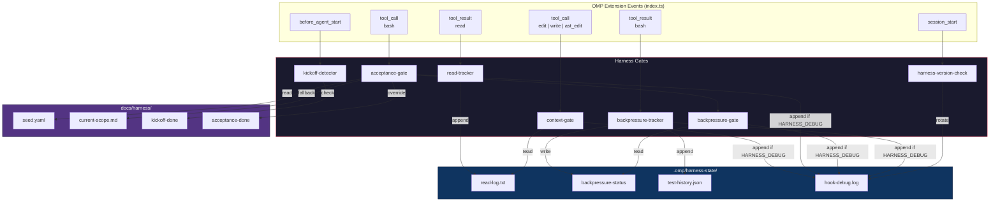
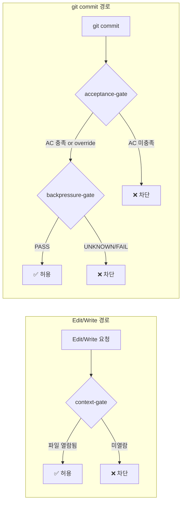
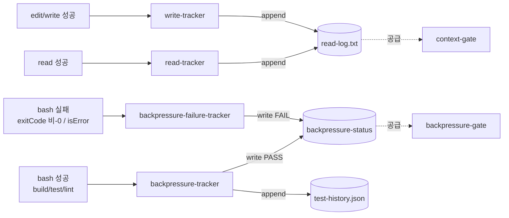
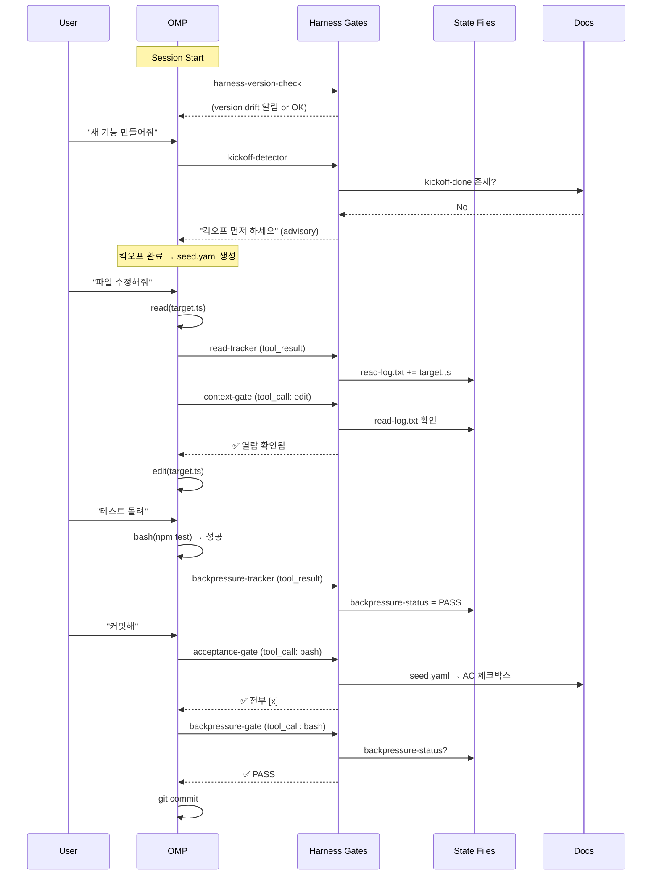
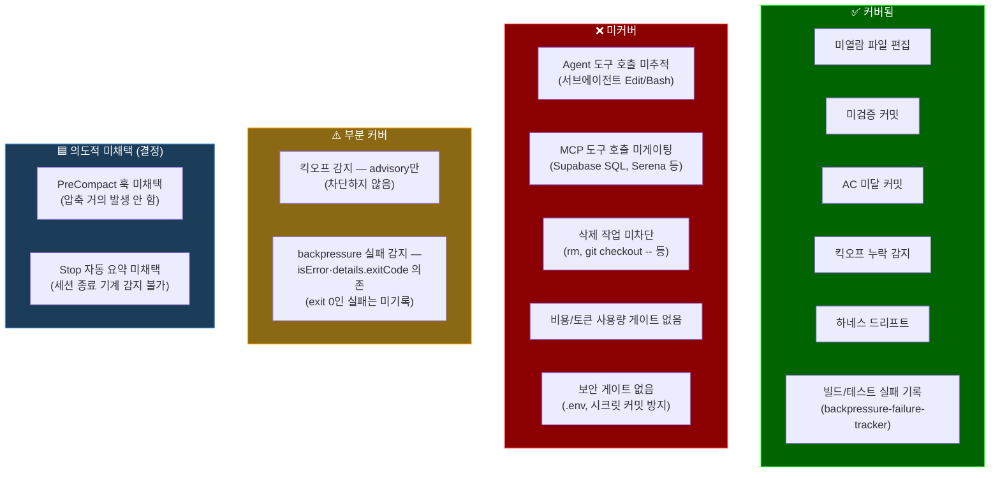
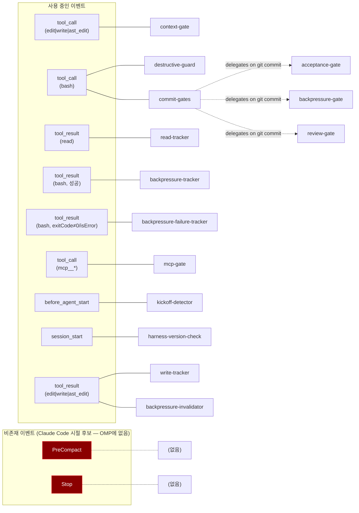
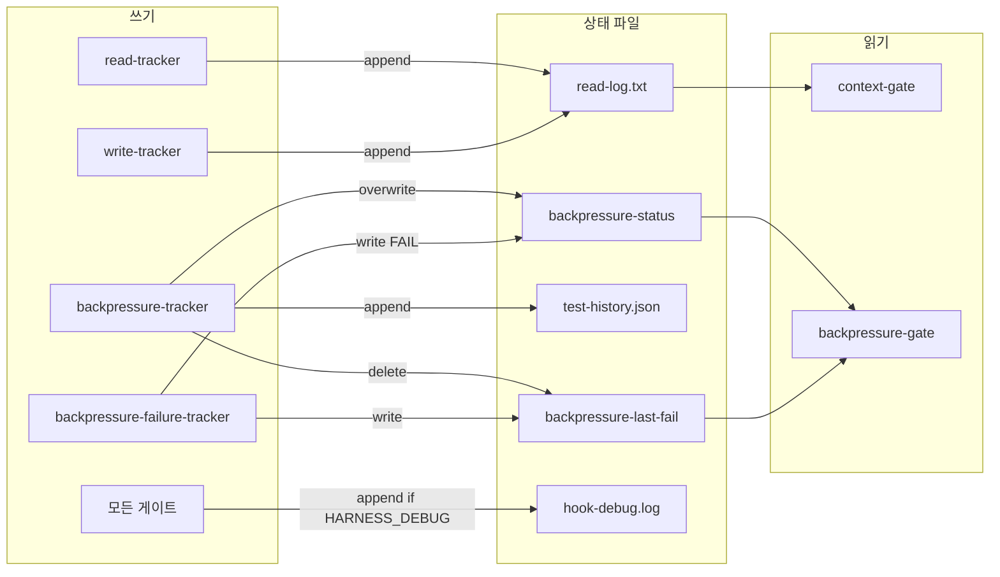

# Harness Architecture — 기능별 분류 및 커버리지 분석

> Generated: 2026-04-23 | Harness v2026.7 | OMP port (원본은 Claude Code 2.1.118 시절 생성)

## 1. 아키텍처 개요

하네스는 OMP의 extension 이벤트 시스템 위에 구축된 **자동화된 품질 게이트 체인**이다.
게이트는 `.omp/extensions/harness/gates/*.mjs`(stdin-JSON CLI)이며, 어댑터 `.omp/extensions/harness/index.ts`가 OMP 이벤트에서 `runGate(...)`로 스폰한다.
에이전트의 행동을 사전/사후로 검증하여, 미확인 편집·미검증 커밋을 차단한다(범위 이탈은 Surgical Changes 규칙 + PR 리뷰로 관리; scope-gate 폐기됨).

## 2. 기능별 분류

### 2.1 사전 차단 게이트 (tool_call — blocking)

코드 변경이나 커밋이 실행되기 **전에** 조건을 검사하고, 불합격 시 `exit 2`로 차단한다.

| 게이트 | 트리거 | 검사 대상 | 차단 조건 | 데이터 소스 |
|--------|--------|-----------|-----------|-------------|
| **context-gate** | edit\|write\|ast_edit | 편집 파일 경로 | read-log에 없음 (미열람) | .omp/harness-state/read-log.txt |
| **acceptance-gate** | bash (git commit) | 수락 기준 체크박스 | 미완료 `[ ]` 존재 | seed.yaml → current-scope.md |
| **backpressure-gate** | bash (git commit) | 빌드/테스트 상태 | status ≠ "PASS" 또는 UNKNOWN | .omp/harness-state/backpressure-status |

### 2.2 사후 추적기 (tool_result — non-blocking)

도구 실행 **후** 상태를 기록한다. 차단하지 않고, 게이트에 데이터를 공급한다.

| 추적기 | 트리거 | 역할 | 출력 |
|--------|--------|------|------|
| **read-tracker** | read (성공) | 열람 파일 경로 기록 | read-log.txt에 append |
| **write-tracker** | edit\|write\|ast_edit (성공) | 작성/편집 파일 경로 기록 (세션 내 작성 파일 재열람 불필요) | read-log.txt에 append |
| **backpressure-tracker** | bash (성공) | 빌드/테스트/린트 성공 기록 | backpressure-status, test-history.json |
| **backpressure-failure-tracker** | bash (실패: `isError` 또는 `details.exitCode`≠0) | 빌드/테스트/린트 실패 기록 | backpressure-status=FAIL, backpressure-last-fail |

### 2.3 감지기 (before_agent_start — advisory)

사용자 프롬프트 제출 시 패턴을 감지하고, 차단하지 않고 **안내 메시지만** 출력한다.

| 감지기 | 트리거 | 감지 패턴 | 출력 |
|--------|--------|-----------|------|
| **kickoff-detector** | 모든 프롬프트 | 새 프로젝트/기능 키워드 (EN/KR) | kickoff 워크플로우 안내 |

### 2.4 세션 관리 (session_start — advisory)

세션 시작 시 1회 실행. 환경 상태를 점검한다.

| 게이트 | 역할 | 캐시 | 네트워크 |
|----|------|------|----------|
| **harness-version-check** | 로컬 vs 리모트 하네스 버전 비교 | 24시간 | git ls-remote |

### 2.5 릴리스 자동화 (Git hooks)

OMP 이벤트가 아니라 **수동/CLI로 실행**한다 (`.githooks/post-commit`은 이제 no-op stub — 예전엔 커밋마다 자동 범프해 churn 발생).

| 스크립트 | 트리거 | 역할 |
|----------|--------|------|
| **harness-version-bump.sh** | 수동 (머지 후 1회) | 마지막 `harness/*` 태그 이후 하네스 변경 시 1회 버전 범프 + 태그 (멱등, `--dry-run` 지원) |
| **harness-sync.sh** | /skill:harness-check 수동 | 리모트에서 최신 하네스 오버라이트 |

## 3. 상태 흐름도 (전체 세션 라이프사이클)

## 4. 커버리지 매트릭스

### 4.1 현재 커버되는 영역

| 위험 영역 | 게이트 | 강도 |
|-----------|--------|------|
| 미확인 파일 편집 | context-gate + read-tracker | **Hard block** (exit 2) |
| 미검증 커밋 (빌드/테스트) | backpressure-gate + tracker | **Hard block** (exit 2) |
| 빌드/테스트 실패 기록 | backpressure-failure-tracker (`tool_result` bash, `isError`/`exitCode`≠0) | Tracking (게이트에 FAIL 공급) |
| 수락 기준 미달 커밋 | acceptance-gate | **Hard block** (exit 2) |
| 새 작업 시 킥오프 누락 | kickoff-detector | Advisory (non-blocking) |
| 하네스 버전 드리프트 | harness-version-check | Advisory (non-blocking) |
| 하네스 파일 버전 관리 | harness-version-bump.sh | Manual (머지 후 1회, deliberate) |

### 4.2 커버되지 않는 영역 (Gap Analysis)

### 4.3 Gap 상세

#### G1. 빌드/테스트 실패 기록 — 해소됨 (OMP 포트)
- **과거 원인**: Claude Code의 `PostToolUse`는 도구가 **성공**했을 때만 트리거되어, 실패한 빌드/테스트가 기록되지 않았다.
- **현재**: OMP 어댑터가 실패한 bash `tool_result`(`isError: true` 또는 `details.exitCode`≠0)를 `backpressure-failure-tracker`로 라우팅 → `backpressure-status=FAIL` + `backpressure-last-fail` 기록 → 실패 후 커밋이 차단된다.
- **잔존 의존성**: OMP는 non-zero exit에 `isError`를 세우지 않고 `details.exitCode`로 보고하므로 어댑터는 둘 다 검사한다 (실측 검증됨). 실패해도 exit 0으로 끝나는 명령(러너가 exit code를 삼키는 경우)은 성공으로 기록됨 (§4.2 P2).

#### G2. 서브에이전트 도구 호출 미추적
- **원인**: OMC가 executor/architect 등 서브에이전트를 생성할 때, 서브에이전트의 Edit/Write는 별도 컨텍스트에서 실행됨.
- **결과**: 서브에이전트가 read 없이 파일을 편집해도 context-gate가 감지 불가.
- **참고**: 현재 아키텍처 제약 — 서브에이전트도 동일 게이트 체인을 탈 수 있으나, read-log는 세션별 독립.

#### G3. MCP 도구 호출 미게이팅
- **원인**: Supabase(DDL), Serena(리팩터링) 등 `mcp__*` 도구 호출은 `mcp-gate`가 advisory 알림만 — 차단·scope 검사 없음.
- **결과**: MCP를 통한 DB 스키마 변경, 심볼 리네이밍 등이 harness 게이트를 우회.
- **대안**: `tool_call` 핸들러의 `mcp__*` 분기에 scope 검사 연동 (예: `mcp__supabase*`).

#### G4. 삭제 작업 미차단
- **원인**: `rm -rf`, `git checkout -- .`, `git clean` 등 파괴적 bash 명령에 대한 **차단** 게이트 없음 (`destructive-guard`는 advisory 경고만).
- **결과**: 에이전트가 실수로 파일을 삭제할 수 있음.
- **대안**: `tool_call`(bash)에서 위험 명령 패턴 매칭을 차단으로 승격.

#### G5. 비용/토큰 사용량 게이트 없음
- **현황**: OMC HUD가 토큰 사용량을 표시하지만, 임계값 초과 시 차단하는 게이트는 없음.
- **결과**: 장시간 세션에서 과다 토큰 소비를 자동 제어할 수 없음.

#### G6. 시크릿/민감 파일 커밋 방지 없음
- **현황**: `.env`, `credentials.json`, API 키 포함 파일의 커밋을 차단하는 게이트 없음.
- **참고**: `.gitignore`가 1차 방어이나, 에이전트가 `git add -f`를 쓰면 우회됨.
- **대안**: `tool_call`(bash)에서 `git add`/`git commit` 시 민감 파일 패턴 검사.

#### G7. PreCompact 훅 — 의도적 미채택 (결정 2026-05-27)
- **현황**: 컨텍스트 압축 전 상태 보존 훅을 두지 않음. **갭이 아니라 결정**임.
- **근거**: 우리 사용 패턴에서 한 세션이 컨텍스트의 ~50%도 채우는 일이 드물어 압축이 거의 발생하지 않음 → 압축 트리거 훅은 사실상 안 돎. 유지비 대비 가치 낮음.
- **참조**: `rules/session_persistence.md`의 "Decision: summarization stays manual" 섹션.
- **갱신(2026-06)**: "이벤트 부재" 전제는 정정됨 — OMP는 `session.compacting`을 노출한다. 단 `breadcrumb-tracker`가 `tool_result`로 디스크에 no-LLM append하므로 압축에 의존하지 않고, **AC2 "보존"은 file-based `session-log.jsonl`이 충족**(압축은 대화만 압축하고 파일은 불변 → 별도 flush/preserve 핸들러 불요). 자율화 Q1.

#### G8. Stop 훅 (세션 요약 부분) — 의도적 미채택 (결정 2026-05-27)
- **현황**: 세션 종료 시 **자동 요약**은 두지 않음. **갭이 아니라 결정**임.
- **근거**: `Stop` 훅은 어시스턴트 턴 종료 시 발화하지, 사용자가 작업 스레드를 끝내는 시점이 아님. 세션 종료는 기계로 감지 불가(사용자만 판단) → Stop 기반 자동 요약은 오발화함. 요약은 `sum` 스킬로 수동 유지.
- **여전히 열린 부분**: test-history 정리·미완료 AC 경고 같은 비-요약 Stop 훅 아이디어는 별개로 검토 가능.
- **참조**: `rules/session_persistence.md`의 "Decision: summarization stays manual" 섹션.
- **갱신(2026-06)**: 자동 **LLM** 요약 미채택은 유효(Q1.4 — 작업 완료를 인코딩하는 이벤트 없음). 단 no-LLM breadcrumb(`breadcrumb-tracker`)은 신설됐고, `session_start`에서 `breadcrumb-surface`가 `docs/sum/`를 표면화한다. 수동 `sum`은 breadcrumb을 seed로 소비.

## 5. 이벤트별 게이트 연결 현황 (`.omp/extensions/harness/index.ts`)

## 6. 상태 파일 의존성 그래프

> `hook-debug.log` is written **only when `HARNESS_DEBUG` is set to a non-empty value** (off by default, to avoid log noise — audit item #8a). The `모든 게이트 → hook-debug.log` edge is an approximation: only the gates/trackers that emit debug traces write there (not `read-tracker`/`write-tracker`, which write `read-log.txt`). Every other state write and all gate/block behavior is independent of `HARNESS_DEBUG`.

## 7. 우선순위별 개선 제안

| 우선순위 | Gap | 제안 | 복잡도 |
|----------|-----|------|--------|
| ~~P0~~ | G1: 실패 미기록 | **해소됨 (OMP 포트)** — 어댑터가 실패 bash `tool_result`(isError·exitCode≠0)를 backpressure-failure-tracker로 라우팅 (§4.3 G1) | — |
| **P0** | G6: 시크릿 커밋 방지 | `tool_call`(bash)에 `git add`/`git commit` 시 `.env`, `*credential*`, `*secret*` 패턴 검사 추가 | Low |
| **P1** | G4: 파괴적 명령 차단 | `tool_call`(bash)에서 `rm -rf`, `git checkout --`, `git clean`, `git reset --hard` 패턴을 차단으로 승격 | Low |
| **P1** | G3: MCP 게이팅 | `tool_call` 핸들러 `mcp__*` 분기에 scope 검사 연동 (`mcp__supabase*` 등) | Medium |
| **P2** | G8: 세션 종료 훅 | 세션 종료 시 미완료 AC 경고 (요약 자동 생성은 미채택 — §4.3 G8; OMP에 Stop 이벤트 없음) | Low |
| **—** | G7: PreCompact | **미채택 (결정 2026-05-27)** — 압축이 거의 발생 안 함 (OMP에 해당 이벤트도 없음). §4.3 G7 | — |
| **P3** | G2: 서브에이전트 | 서브에이전트용 read-log 공유 메커니즘 (현재 아키텍처 제약) | High |
| **P3** | G5: 비용 게이트 | 토큰 임계값 초과 시 경고/차단 (OMC HUD 연동) | Medium |
