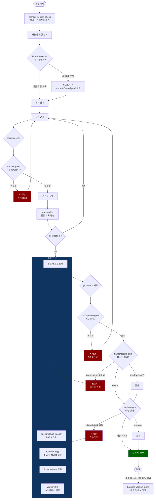
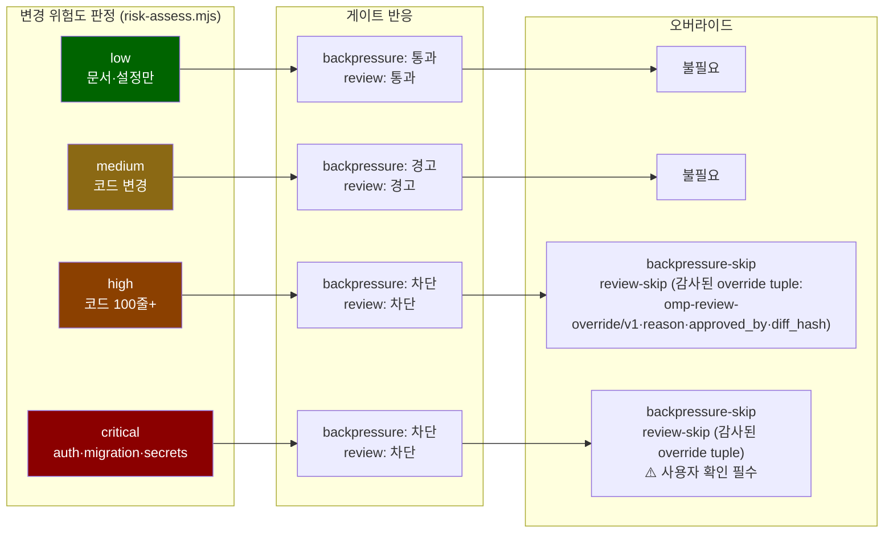
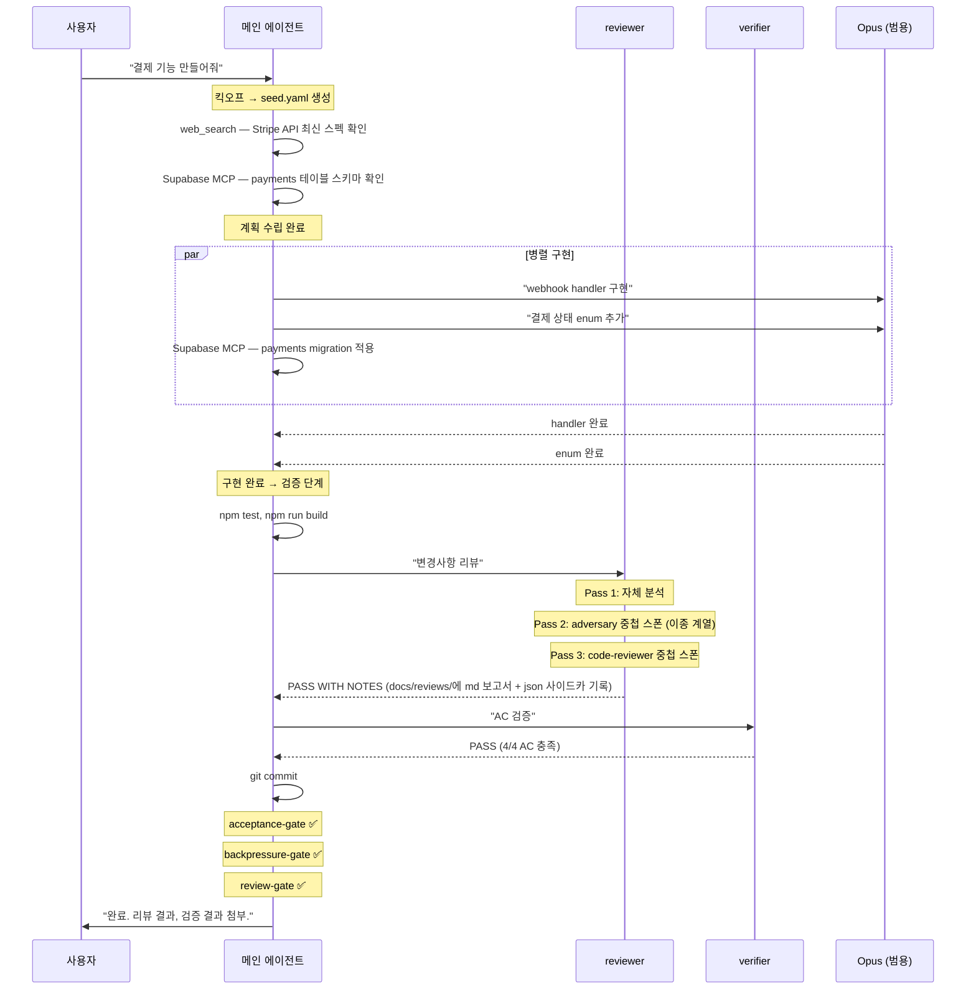

# 작업 라이프사이클 — 하네스 기반 전체 흐름

> Generated: 2026-04-24 | Harness v2026.7

## 1. 전체 흐름 (한눈에)



## 2. 단계별 상세

### 2.1 세션 시작

```
사용자가 OMP 세션을 시작
  → [session_start] harness-version-check 실행
    → 로컬 하네스 버전 vs 리모트 최신 태그 비교
    → 드리프트 있으면 알림 (24시간 캐시)
  → 시스템 프롬프트에 AGENTS.md 로드
    → Agent Routing Policy, MCP Policy 등 활성화
```

여기서 결정되는 것: 메인 에이전트가 어떤 규칙 체계 아래에서 동작하는지.

### 2.2 킥오프 (새 작업 감지 시)

```
사용자: "새 결제 기능 만들어줘"
  → [before_agent_start] kickoff-detector가 패턴 감지
    → "새 기능" 키워드 + kickoff-done 파일 없음
    → advisory: "킥오프 먼저 하세요"
  
  → 메인 에이전트가 사용자와 대화형 인터뷰
    → Goal, Constraints, AC, Out of Scope, Assumptions 정의
    → docs/harness/seed.yaml 생성
    → docs/harness/kickoff-done 생성
```

여기서 결정되는 것:
- **acceptance-gate**가 참조할 AC 체크박스
- 이후 모든 게이트의 판단 기준

### 2.3 계획

```
메인 에이전트가 구현 계획 수립
  → 복잡하면 OMC planner 활용 가능
  → 외부 정보 필요하면 web_search/explore 직접 수행
  → DB 스키마 확인 필요하면 Supabase MCP 직접 조회
  
  이 단계에서는 edit/write를 안 하므로 게이트에 안 걸림
```

### 2.4 구현

```
메인 에이전트 또는 범용 Opus 서브에이전트가 코드 작성

파일을 편집하려면:
  1. 먼저 read → read-tracker가 read-log.txt에 기록
  2. edit/write 시도
     → [tool_call] context-gate: read-log.txt 확인
       → 미열람이면 차단 + "먼저 read하세요"
     → 둘 다 통과하면 편집 실행

병렬 구현:
  → 독립적인 파일/모듈이면 Opus 서브에이전트 여러 개 동시 실행
  → 각 서브에이전트도 같은 게이트 체인을 탐 (같은 .omp/harness-state/ 공유)

MCP 필요 시:
  → DB 작업 → Supabase MCP 직접 호출 (DDL은 migration)
  → 리팩터링 → edit + OMC LSP로 참조 선확인
  (구 MCP 위임 매트릭스는 2026-06 폐기 — rules/agent_routing.md 참조)
```

### 2.5 검증

구현이 끝나면, 커밋 전에 검증 단계를 거침.

```
1. 빌드/테스트 실행
   → npm test, npm run build 등
   → [tool_result] backpressure-tracker가 성공 기록
     → backpressure-status = "PASS"
     → test-history.json에 추가
   → 실패하면 [tool_result, exitCode≠0/isError] backpressure-failure-tracker가 FAIL 기록

2. reviewer 호출 (코드 변경 ≥10줄 or 로직 변경)
   → Pass 1: reviewer 자체 분석 (@slow 롤)
   → Pass 2: adversary 에이전트 중첩 스폰 (@advisor 롤, 이종 계열 — 트랜스크립트 model_change 실측)
   → Pass 3: code-reviewer 에이전트 중첩 스폰 (`.omp/agents/` 프로젝트 정의 — OMC 불요)
   → 3개 결과 교차 검증
   → docs/reviews/review-YYYY-MM-DD-HHMMSS.md (사람용 보고서)
     + 동일 베이스명 .json 사이드카 (기계 증거 — 게이트가 읽는 유일한 파일)
   → Verdict: PASS / PASS WITH NOTES / FAIL

3. verifier 호출 (AC 있을 때 필수)
   → seed.yaml AC 항목별 증거 확인
   → 하네스 게이트 상태 확인
   → 빌드/테스트 직접 재실행
   → scope 이탈 여부 확인
   → Verdict: PASS / FAIL / INCOMPLETE
```

### 2.6 커밋

```
git commit 시도
  → [tool_call: bash] commit-gates가 3개 게이트 순차 실행:

  1. acceptance-gate
     → seed.yaml AC 체크박스 확인
     → 미완료 [ ] 있으면 → 차단
     → acceptance-done 플래그 있으면 → 통과

  2. backpressure-gate (위험도 인식)
     → risk-assess.mjs로 변경 유형 판단
     → low (문서만) → 통과
     → medium (코드) + 상태 없음 → 경고
     → high/critical + PASS 아님 → 차단
     → backpressure-skip 플래그 있으면 → 통과

  3. review-gate (위험도 인식)
     → risk-assess.mjs로 변경 유형 판단
     → low → 통과
     → medium + 리뷰 없음 → 경고
     → high/critical + 2차 관점 증거 없음 → 차단
       (기계 증거 = 오늘자 review-*.json 사이드카의 strict 위치 기반 JSON tuple:
          ["omp-review-evidence/v1", diff_hash(hex64),
           "PASS"|"PASS WITH NOTES"|"FAIL", models|null, human|null, reviewer]
        — 마크다운은 파싱하지 않음(.md는 사람용 보고서); tuple에는 키가 없어
          중복 키 last-wins 주입이 구조적으로 불가, 스키마 위반 파일은 경고 후 무시)
       (증거축: ① 이종 모델 리뷰 — 실측 models 배열 2계열 이상
          (thread/session id는 증거 불인정)
        ② human-review — human_reviewed_by에 사람 식별자 (모델명 불인정)
        ③ 감사된 override)
     → 커버하는 tuple의 verdict FAIL → 차단
     → review-skip이 ["omp-review-override/v1", reason, approved_by, diff_hash] tuple이면
       → audit.jsonl에 review_override 기록 후 통과 (bare/비-tuple 플래그는 차단;
          audit.jsonl이 git 추적 중이면 `git commit -a`에서는 소비 불가 — fail-closed)

  전부 통과하면 커밋 성공

  → [머지 후 수동 1회] bash scripts/harness-version-bump.sh
    → 마지막 harness/* 태그 이후 하네스 변경이 있으면 버전 범프 + 태그 (멱등; 자동 아님)
```

### 2.7 완료 보고

```
메인 에이전트가 사용자에게 보고:
  → Applied rules
  → Evidence (파일 경로, 커맨드 출력)
  → Verification (reviewer/verifier 결과 참조)
```

## 3. 위험도별 게이트 동작 요약



## 4. 서브에이전트 호출 타이밍

(2026-06: researcher/db-worker/refactorer/full-context 위임 매트릭스 폐기 —
외부 정보·DB는 메인 에이전트가 직접 수행. `rules/agent_routing.md`의 폐기 기록 참조.)


